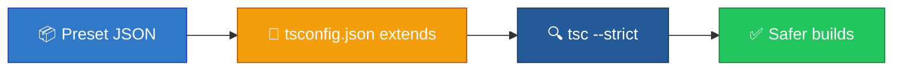

<p align="center">
  
</p>

<h1 align="center">typescript-tsconfig-presets</h1>

<p align="center">
  <strong>EN</strong> Strict tsconfig bases for Node & general TS<br/>
  <strong>PT</strong> Bases de tsconfig strict para Node e TypeScript geral
</p>

<p align="center">
  <a href="https://github.com/manansbdb/typescript-tsconfig-presets/blob/main/LICENSE"></a>
  
  
  <a href="#support--apoio"></a>
</p>

---

## What it does / Para que serve

| English | Português |
|---------|-----------|
| **Strict `tsconfig` presets** you can extend from — Node and general/strict bases. | **Presets `tsconfig` strict** para estender — bases Node e geral/strict. |
| Copy a preset and set `"extends"` in your project `tsconfig.json`. | Copia um preset e usa `"extends"` no `tsconfig.json` do projeto. |



---

## Install / Instalação

### 1) Clone / Clona

```bash
git clone https://github.com/manansbdb/typescript-tsconfig-presets.git
cd typescript-tsconfig-presets
```

### 2) Copy presets / Copia presets

```bash
mkdir -p /path/to/your-project/tsconfig
cp tsconfig.strict.json /path/to/your-project/tsconfig/
cp tsconfig.node.json /path/to/your-project/tsconfig/
```

### 3) Extend / Estende

```json
{
  "extends": "./tsconfig/tsconfig.strict.json",
  "include": ["src"]
}
```

### Requirements / Requisitos

- TypeScript installed in the target project
- `git`

---

## Quick start / Início rápido

```bash
git clone https://github.com/manansbdb/typescript-tsconfig-presets.git
cp typescript-tsconfig-presets/tsconfig.strict.json ./tsconfig.strict.json
# point your tsconfig.json "extends" at it
```

---

## Contents / Conteúdos

| Path | Purpose / Função |
|------|------------------|
| `tsconfig.strict.json` | Strict base |
| `tsconfig.node.json` | Node-oriented base |
| `notes.md` | Usage notes |
| `SUPPORT.md` | Donations / Doações |

---

## Project layout / Estrutura

```text
typescript-tsconfig-presets/
├── docs/banner.svg
├── tsconfig.strict.json
├── tsconfig.node.json
├── notes.md
├── SUPPORT.md
└── README.md
```

---

## Support / Apoio

Bitcoin donations welcome / Doações em Bitcoin bem-vindas:

```
bc1q0qfnlnxyum9u45stzxe0a7jnhtj4j0usfkqdjw
```

See [SUPPORT.md](./SUPPORT.md).

---

## License / Licença

[MIT](./LICENSE) © 2026 manansbdb
